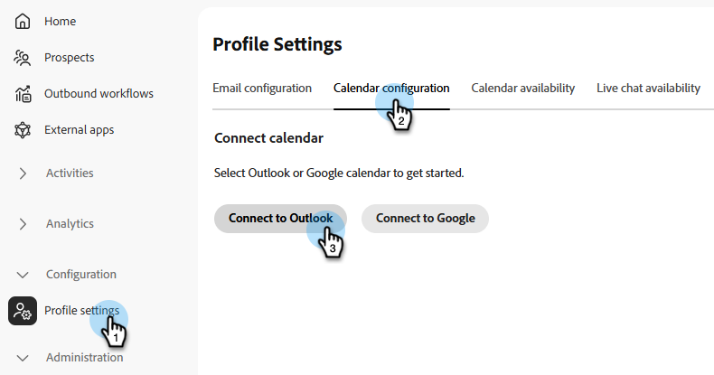
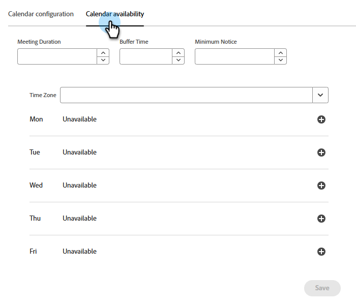
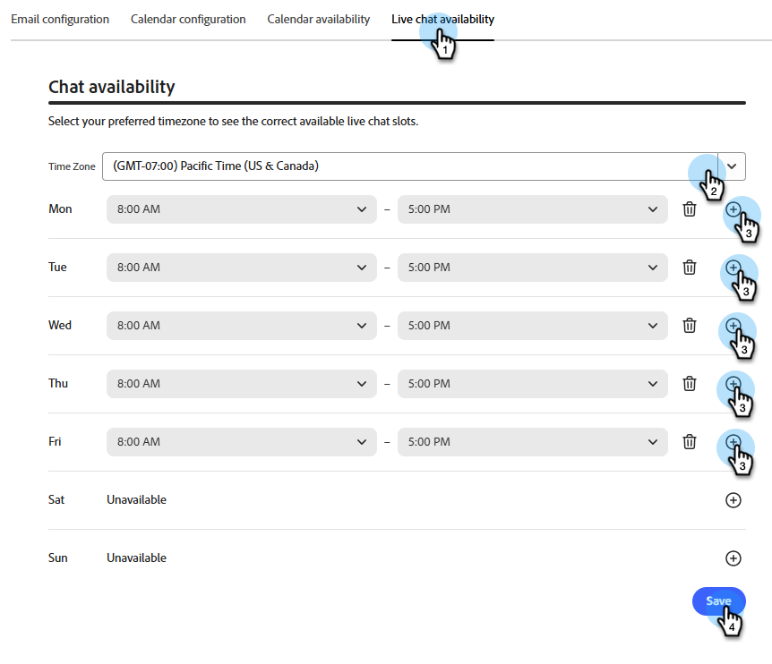

# Reuniones {#meetings}

Conozca todos los ajustes de _Meeting_ en Adobe Brand Concierge. Conecte el calendario, establezca la disponibilidad, vea los análisis y mucho más.

>[!NOTE]
>
>También puedes ver el vídeo [Reservar una reunión](../getting-started/meeting-booking.md).

## Configuración {#configuration}

Conéctese a su cuenta de Outlook o Google y determine varias opciones de configuración, como el día de la semana, el huso horario y la duración de la reunión.

### Conectar el calendario {#connect}

1. Inicie sesión en [Adobe Experience Platform](https://experience.adobe.com/){target="_blank"}.

1. Seleccione **[!UICONTROL Calificador de ventas]**.

   {width="800" zoomable="yes"}

1. En _Configuración_, haga clic en **Configuración del perfil**. En la pestaña **[!UICONTROL Configuración del calendario]**, elija el calendario que desee.

   

1. Elija una cuenta que ya haya iniciado sesión o agregue una nueva.

   

1. Una vez finalizada la conexión, especifique el contenido de correo electrónico que desee.

   Este es el contenido que se envía al destinatario cuando reserva una reunión con usted. También puede incluir un vínculo a una reunión de Microsoft Teams (opcional).

   

1. Haga clic en **[!UICONTROL Guardar]**.

### Establecer disponibilidad del calendario {#calendar-availability}

1. Haga clic en la ficha **[!UICONTROL Disponibilidad del calendario]**.

   

1. Elija la configuración que desee.

   >[!NOTE]
   >
   >Para agregar más opciones de tiempo, haga clic en el signo más ().

   

1. Haga clic en **[!UICONTROL Guardar]**.

### Establecer disponibilidad de chat en vivo {#chat-availability}

1. Haz clic en la pestaña **[!UICONTROL Disponibilidad del chat en vivo]** y elige la configuración que desees. Haga clic en **Guardar** cuando haya terminado.

   

### Administrar miembros {#manage}

**Solo administradores**. Vea cuál de sus representantes ha conectado correctamente su calendario.

## Actividades {#activities}

Haga clic en **[!UICONTROL Reservas de reuniones]** para revisar las reuniones que se han reservado, ver qué información se ha capturado, saber cuándo se programó la reunión y mucho más.

### Página de reunión {#bookings}

{width="800" zoomable="yes"}

## Analytics {#analytics}

Haga clic en **[!UICONTROL Rendimiento de la reunión]** para revisar varias categorías de análisis diferentes, incluyendo cuántos visitantes han solicitado reuniones y cuántas se han perdido. Se puede ver cuál ha sido la tendencia de las reuniones, quiénes son los representantes que tomaron las reuniones, y mucho más.

### Página Reuniones {#performance}

{width="800" zoomable="yes"}
